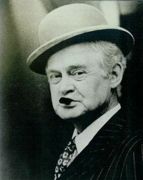
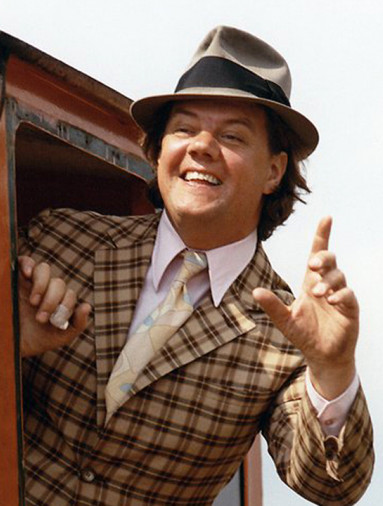
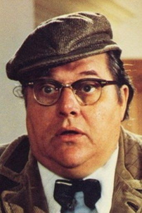

# Die Olsenbande

Ein liebenswertes Gaunertrio, das zu jedem Anlass einen Millionen-schweren Plan hat.
Bei den Coups, wie ihre Aktionen von Egon Olsen genannt werden, "bedienen" sie sich nur bei den Reichen, die schon genug Geld haben oder es auf illegale Weise erlangt haben. 
Nie würden sie sich an den "kleinen Leuten" vergreifen.  
Die Beute befindet sich meistens in Tresoren der Marke "Franz Jäger Berlin", auf die Egon Olsen spezialisiert ist. 
Schnell ist man geneigt zu sagen: Es sind ehrliche Kleinkriminelle. Hier wird das Leben mit einem großen Augenzwinkern betrachtet.
  

## Egon
* Name: Egon Olsen
* Schauspieler: Ove Sprogøe
* Funktion: Anführer der Bande
* Namensgeber der Bande
* Hat immer einen Plan
  

Zitat:
> Ich habe einen Plan!

  

    

## Benny
* Name: Benny Frandsen
* Schauspieler: Morten Grunwald
* Funktion: Fahrer (von Auto bis Panzer)
* Trägt Schlapphut, ein kariertes Sakko und gelbe Socken
* Hopst und Hüpft beim gehen
  

Zitat:
> Mächtig gewaltig Egon!

  

    

## Kjeld
* Name: Kjeld Jensen
* Schauspieler: Poul Bundgaard
* Funktion: Beschafft die benötigten Gegenstände für den Coups
* Trägt Schiebermütze, Fliege und Hebammentasche
* Steht unter der Fuchtel von Yvonne
  

Zitat:
> Ist das Gefährlich?

  

    